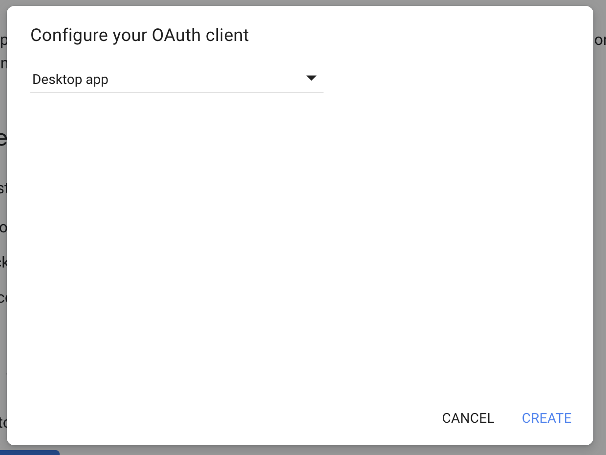

# Projet neomail

# Présentation du projet
Le projet neomail est un outil qui permet de trier/classer vos mails grace à des labels construit par un modèle de clustering.

neomail project can to classify your mail from labels. labelling is build from clustering model.

# Lancer le projet en local

Vous devez d'abord vous rendre au lien suivant afin de générer votre compte de service :

1 . https://developers.google.com/gmail/api/quickstart/python


cliquer sur "Enable the Gmail API"

2 . Choisir "Desktop app" et cliquer sur "CREATE"


3 . renommé le en client_secret_localhost.json et placé le dans dossier "resources".

Information : client_secret_localhost.json : Fichier d'autorisation pour l'API Gmail. Ce fichier est propre à votre mail.

## Lancer le projet
```bash
docker-compose up --build -d
```
