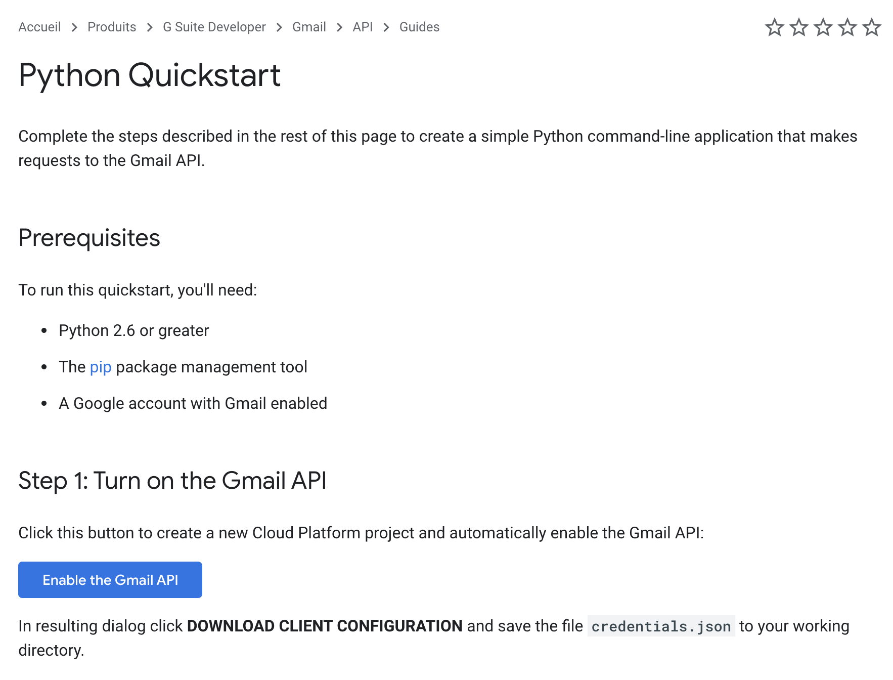

# Ika project
[](https://opensource.org/licenses/Apache-2.0)
[]()
[](https://microbadger.com/images/robertbeal/markdown-link-checker "Get your own version badge on microbadger.com")


## Project Introduction
Ika is application to doing classification of mail thank to labels builded by a clustering model of machine learning.

This project was started as part of the school project during my master's degree and was then improved in my free time.
Ika is still under development and more modifications will come.

## Run project in localhost

First of all, you need to go this link to generate credential :

1 . https://developers.google.com/gmail/api/quickstart/python



click on "Enable the Gmail API"

2 . Choice "Desktop app" and click on "CREATE"


3 . rename file to client_secret_localhost.json and put it in "resources" in ika_web folder.

Information : client_secret_localhost.json : File to give autorisation for l'API Gmail. THis file is unique to Gmail.

You need install docker and docker-compose to run project.
install docker : https://docs.docker.com/docker-for-windows/install/

Run project
```bash
docker-compose up --build -d
```

to launch Ika, go to the following link
```bash
http://127.0.0.1:8080/api/v1/google/authorize
```

I invite you to read the README.md of each micro-services.

- [Ika Web](ika_web/README.md)
- [Ika Streamer](ika_streamer/README.md)
- [Ika Classifier](ika_classifier/README.md)

### Information
This project using one package created by me : [Ikamail](https://pypi.org/project/ikamail/)

The part of reseach of machine-learning model has been realized on this repository : [ika-search](https://github.com/Harisonm/ika-research) 

## Remerciement and gratitude
I would like thank <a href="https://github.com/LorgneSchilooch">Olivier Queret</a> for your helps and contributions.

I would like to thank God for the time he has given me to work on this project. May this project inspire others people.

Be blessing.

###### Auteur : *Manitra Andréa RANAIVOHARISON*. 
