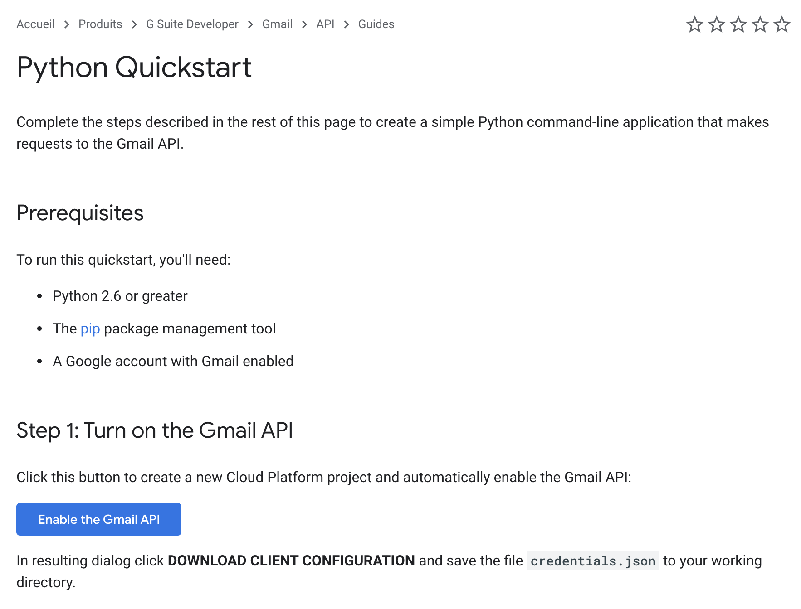
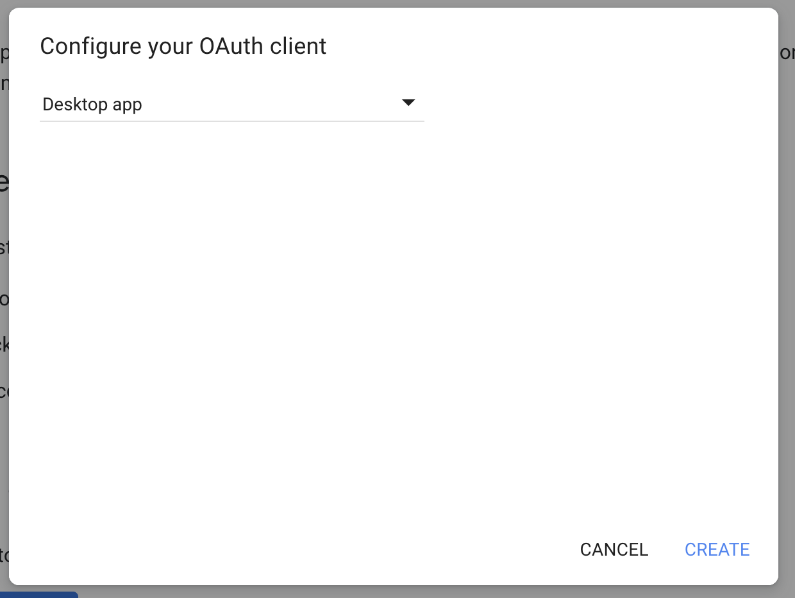

# Projet neomail

# Présentation du projet
Le projet neomail est un outil qui permet de trier/classer vos mails grace à des labels construit par un modèle de clustering.

neomail project can to classify your mail from labels. labelling is build from clustering model.

# Lancer le projet en local

Vous devez d'abord vous rendre au lien suivant afin de générer votre compte de service :

1 . https://developers.google.com/gmail/api/quickstart/python



cliquer sur "Enable the Gmail API"

2 . Choisir "Desktop app" et cliquer sur "CREATE"


3 . renommé le en client_secret_localhost.json et placé le dans dossier "resources".

Information : client_secret_localhost.json : Fichier d'autorisation pour l'API Gmail. Ce fichier est propre à votre mail.

# Ika-Web

## Lancer à partir d'un environnement virtual python

1. Installer virtualenv
```
virtualenv python_37
```

2. Activer l'environement
```
source python_37/bin/activate
```

3. Installer les librarie pour le serveur Web
```
pip install -r src/ika_web/requirements.txt
```

4. Lancer le programme
```
bash run_web_server.sh
```

## Test de l'API

### S'inscrire
http://127.0.0.1:8040/api/v1/auth/signup

```json
{
	"email":"manitra@me.fr",
	"password":"test"
}
```

### Se connecter
http://127.0.0.1:8040/api/v1/auth/login

```json
{
	"email":"manitra@me.fr",
	"password":"test"
}
```
Cc le Token obtenu

### Obtenir le credential Google propre à se compte
```
http://127.0.0.1:8040/api/v1/credentials
```

Sur postman :
Get
1. Authorization
2. Type : Bearer Token
3. Coller le Token

```json
{
    "token": "XXX"
}
```

# Ika-web
Lancer serveur SMTP : 
```bash
python -m smtpd -n -c DebuggingServer localhost:1025 
```

Pour exécuter un test d'isolation
```
python -m unittest ika_web/tests/test_signup.py
```

Pour exécuter tous les tests en même temps, utilisez la commande:
```bash
python -m unittest --buffer

--bufferou -best utilisé pour ignorer la sortie lors d'un test réussi.
```

# Ika-Streamer
## Lautch Streamer
```
uvicorn ika_streamer.app.main:app --reload --port 8080
```